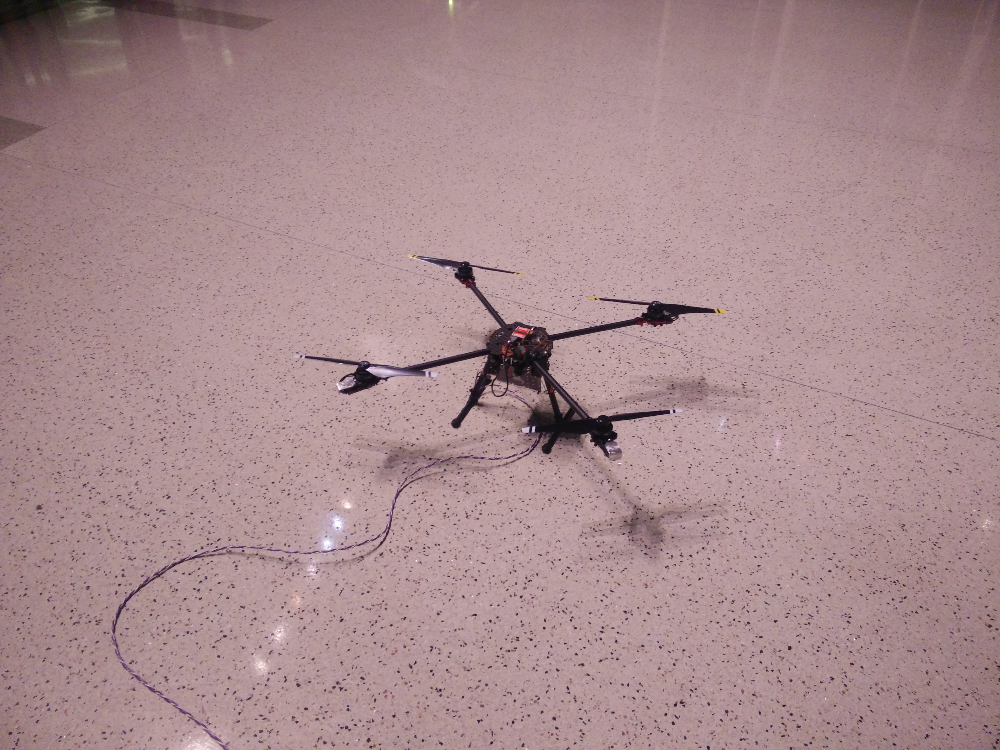
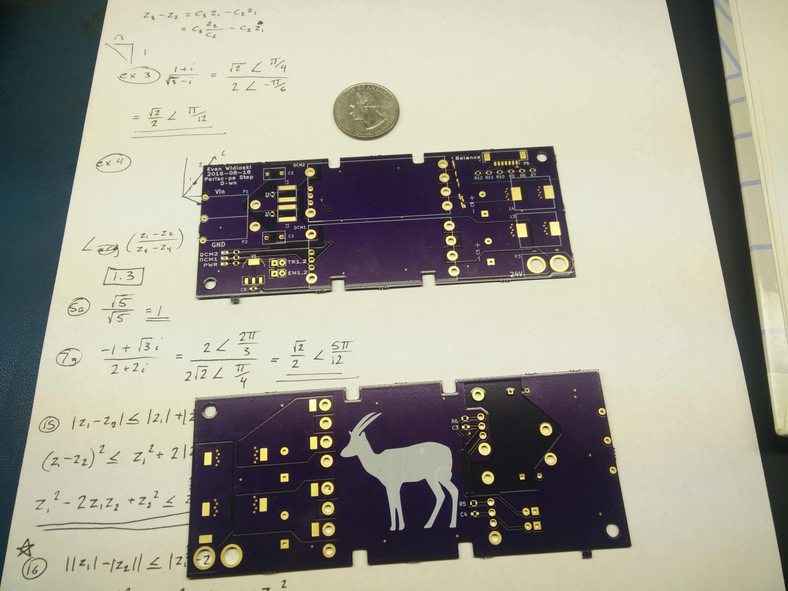
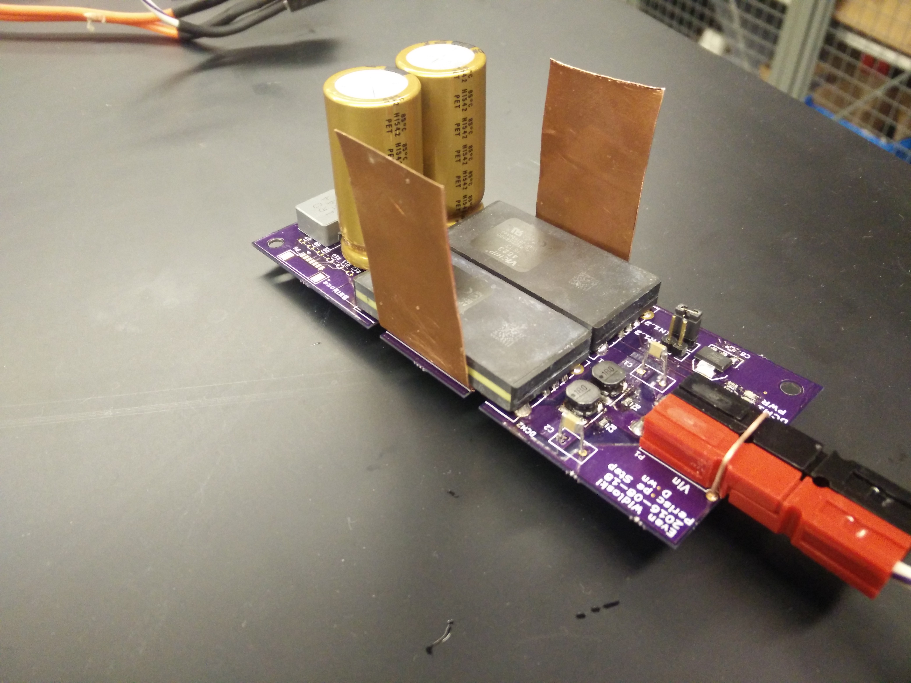

This is a drone project I'm working on with a friend.  The goal is to develop a drone that can achieve extended flight times with applications in animal observation in nature reserves and private security.  These applications necessitate flight times upwards of 6 hours and the ability to haul a nontrivial camera load.  In addition, the drone needs to stay centered over the landing pad and possibly follow (for example, if the landing pad is in the bed of a truck).

Before starting design, I did some back of the envelope calculations to get a rough estimate for the power levels and payloads I could work with.  Here are some initial estimates assuming a cable voltage of ~120VAC.

## Estimates
* quad dji inspire 1 + tb47 battery (6S, 25C, 22.2V, 4.5Ah)
* quad + battery = 2935g
* battery = 570g
* max takeoff weight = 3400g
* maximum takeoff payload = 3400 - (2935 - 570) = 1035g

assumption: max payload is about twice max takeoff payload -> 2kg

assumption: battery is 25C

* 25C battery -> (25C)(4.5Ah) = 112.5A continuous supply

assumption: quad draws 15A continuous

assumption: quad draws 30A peak

* 22 AWG wire, 2 conductor, rated for -20 to 80 degrees C - http://products.conwire.com/item/onductor-cable-ul-cm-cmg-ul-style-2464-csa-ft4-c-3/onductor-cable-ul-cm-cmg-ul-style-2464-csa-ft4-cmg/5400-cl#Specifications
* 14.935 g/ft - http://www.taiyocable.com/pdf/catalog/2014/CM-2464-1007-IIA-SB-20141219.pdf
* (2kg)/(14.935 g/ft) = 133ft
* 22 AWG -> .016 ohm/ft resistivity

assumption: we want to drop no more than 10V over 200ft at continuous current (continuous tether current and cont. quad current are not the same)

* Vdrop = (cable resistance)(cable length)(cable current)
* Vdrop = (.016 ohm/ft)(200ft)(cont. tether current) -> tether current = 3.125A max
* (tether voltage)(cont. tether current) = (quad voltage)(cont. quad current)
* (tether voltage)(3.125A) = (22.2V)(15A) -> tether voltage = 106.73V
* this means the voltage input to the quad DC/DC brick would be anywhere from 116.73V (no current drawn), to 96.73V (peak current draw)
* you need to pick a DC/DC adapter that has max/min Vin well outside this range
* (power dissipation/ft) = (cont. tether current)(cable resistivity)
* (power dissipation/ft) = (3.125A)(.016 ohm/ft) = 0.15625 W/ft <- insignificant heat dissipation
* http://electronics.stackexchange.com/questions/22334/how-do-i-calculate-the-temperature-rise-in-a-copper-conductor

